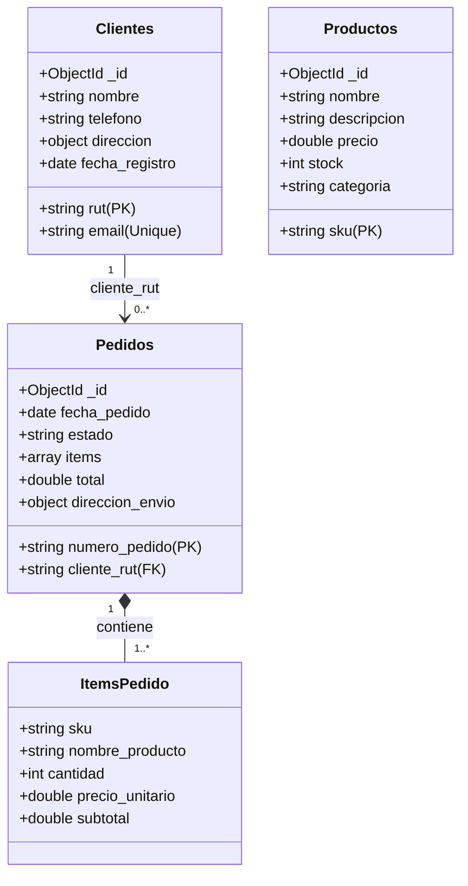

# ComercioTech - CRUD Seguro en Python + PyMongo (NoSQL)

Este proyecto implementa el sistema de base de datos NoSQL para **ComercioTech** (e-commerce), desarrollado como la entrega final para la asignatura **Bases de Datos No Estructuradas (TI3032)** de Ingeniería en Ciberseguridad, INACAP.

---

## 1. Justificación Tecnológica

Para el desarrollo de ComercioTech se seleccionó **Python 3.11+** junto con el driver oficial **PyMongo**. Los fundamentos de esta elección son:
- **Driver Oficial y Estable**: PyMongo es mantenido directamente por MongoDB, lo que garantiza compatibilidad al 100% con las últimas características del motor (transacciones, `$jsonSchema`, índices complejos, agregaciones).
- **Enfoque en Ciberseguridad**: Python ofrece librerías estándar potentes para encriptación e integridad (como `hashlib` para hashing SHA-256 de contraseñas) y compatibilidad directa con gestores de secretos mediante variables de entorno (`python-dotenv`), evitando la fuga de credenciales.
- **Tipado Dinámico y Flexibilidad NoSQL**: La sintaxis nativa de diccionarios de Python se mapea de forma directa a documentos BSON de MongoDB, permitiendo un desarrollo ágil sin la sobrecarga de ORMs complejos.

---

## 2. Modelo de Datos y Relaciones

El sistema opera sobre tres colecciones principales estructuradas bajo un modelo híbrido (referenciación para relaciones uno-a-muchos y anidamiento para relaciones uno-a-uno o subdocumentos estáticos):



### Relaciones:
1. **Clientes ↔ Pedidos (Referenciación)**: Relación $1:N$. Cada pedido almacena el campo `cliente_rut` (RUT del cliente). Se eligió referenciar por el RUT único del cliente en lugar de anidar los pedidos dentro del cliente. Esto previene que el documento del cliente exceda el límite físico de 16MB de MongoDB a medida que realiza compras.
2. **Pedidos ↔ Productos (Anidamiento Dinámico)**: Los ítems comprados se guardan dentro del pedido como un arreglo de objetos (`items`). Cada item contiene una copia histórica del `nombre_producto` y el `precio_unitario` al momento de la compra. Esto garantiza que si el precio de un producto cambia en el catálogo general, el total histórico del pedido facturado no se vea alterado (integridad de auditoría).

---

## 3. Esquemas de Validación ($jsonSchema)

A nivel de base de datos en MongoDB, se aplican reglas de validación estrictas mediante `$jsonSchema` para garantizar la integridad estructural de los datos.

### Clientes
- Requeridos: `rut`, `nombre`, `email`, `telefono`, `direccion`, `fecha_registro`.
- Patrón RUT: `^\d{7,8}-[\dkK]$` (sin puntos y con guión).
- Patrón Email: Correo estándar estructurado.

### Productos
- Requeridos: `sku`, `nombre`, `precio`, `stock`, `categoria`.
- SKU: Código alfanumérico con guiones, mínimo 3 caracteres.
- Precio y Stock: No pueden ser negativos. Stock debe ser entero.

### Pedidos
- Requeridos: `numero_pedido`, `cliente_rut`, `fecha_pedido`, `estado`, `items`, `total`, `direccion_envio`.
- Estado: Limitado por enum `["pendiente", "pagado", "despachado", "entregado", "cancelado"]`.
- Items: Arreglo obligatorio con mínimo 1 elemento, validando subcampos como cantidad y precios positivos.

*Las especificaciones completas de los esquemas se encuentran en [jsonschema_colecciones.py](file:///c:/wamp64/www/nohinohey/src/schemas/jsonschema_colecciones.py) y en el script de base de datos [setup_indices.js](file:///c:/wamp64/www/nohinohey/scripts/setup_indices.js).*

---

## 4. Estrategia de Indexación

Para asegurar búsquedas eficientes a escala de producción, se definen los siguientes índices:

| Colección | Índices Aplicados | Tipo de Índice | Justificación |
| :--- | :--- | :--- | :--- |
| **clientes** | `rut: 1` | Único / Simple | Clave primaria de negocio. Búsqueda directa del perfil de cliente. |
| **clientes** | `email: 1` | Único / Simple | Evita duplicidad de cuentas de correo y acelera la búsqueda en login/registro. |
| **productos**| `sku: 1` | Único / Simple | Clave primaria de negocio. Búsqueda directa en catálogo e inserción de pedidos. |
| **productos**| `categoria: 1` | Simple | Optimiza el filtrado y navegación de productos por departamento en la tienda. |
| **pedidos**  | `numero_pedido: 1`| Único / Simple | Búsqueda e identificación única del documento de pedido. |
| **pedidos**  | `cliente_rut: 1` | Simple | Optimiza la consulta del historial de pedidos de un cliente específico. |
| **pedidos**  | `fecha_pedido: -1`| Simple | Acelera la ordenación descendente (pedidos más recientes primero). |
| **pedidos**  | `estado: 1`, `fecha_pedido: -1`| Compuesto | Optimiza las búsquedas del panel de administración (ej: pedidos pendientes más recientes). |

---

## 5. Control de Acceso Basado en Roles (RBAC)

El control de accesos se implementa en dos capas complementarias para garantizar una postura de seguridad robusta:

### Capa 1: Lógica de Aplicación (Python Decorators)
En `src/auth.py` se implementa el decorador `@requiere_rol` que restringe el uso de los métodos CRUD. Los roles definidos son:
- **`admin`**: Acceso sin restricciones (CRUD completo en clientes, productos, pedidos, gestión de usuarios).
- **`vendedor`** (u operador):
  - **Clientes**: Crear, Leer, Actualizar (No puede Eliminar).
  - **Pedidos**: Crear, Leer, Actualizar (No puede Eliminar).
  - **Productos**: Solo Lectura (No puede Crear, Modificar ni Eliminar).

Si un usuario con el rol de `vendedor` intenta ejecutar una acción restringida, el sistema lanza la excepción personalizada `AccesoDenegadoError` e interrumpe la ejecución de forma segura.

### Capa 2: Seguridad en el Motor MongoDB (Native Users)
El script [setup_usuarios_mongo.js](file:///c:/wamp64/www/nohinohey/scripts/setup_usuarios_mongo.js) define los accesos reales dentro del motor MongoDB:
- **`comerciotech_admin`**: Asignado al rol integrado `dbOwner`. Tiene control total de lectura, escritura y administración sobre la base de datos `comerciotech`.
- **`comerciotech_vendedor`**: Se crea un rol personalizado llamado `roleVendedor` con privilegios específicos a nivel de colección:
  - Colección `clientes` y `pedidos`: Acciones `find`, `insert` y `update` (excluye `remove`).
  - Colección `productos`: Acción `find` (excluye `insert`, `update`, `remove`).

---

## 6. Instrucciones de Instalación y Configuración

### Requisitos Previos
- Python 3.11+ instalado.
- MongoDB Server activo localmente (puerto `27017`) o una cuenta en MongoDB Atlas.

### Pasos para la Instalación

1. **Clonar o descargar el proyecto** en su máquina local.
2. **Crear y activar el entorno virtual**:
   ```bash
   # En Windows:
   python -m venv venv
   .\venv\Scripts\activate
   ```
3. **Instalar dependencias**:
   ```bash
   pip install -r requirements.txt
   ```
4. **Configurar variables de entorno**:
   Copie el archivo de ejemplo `.env.example` y renómbrelo a `.env`:
   ```bash
   copy .env.example .env
   ```
   Edite el archivo `.env` con las credenciales de conexión reales de su servidor MongoDB.

---

## 7. Inicialización de la Base de Datos

Si posee acceso de terminal a su instancia de MongoDB, puede ejecutar los scripts de configuración:

### Inicializar Colecciones, Esquemas e Índices:
```bash
mongosh localhost:27017/comerciotech scripts/setup_indices.js
```

### Configurar Usuarios y Roles de Base de Datos:
```bash
mongosh localhost:27017/comerciotech scripts/setup_usuarios_mongo.js
```

---

## 8. Guía de Ejecución y Pruebas

### Ejecutar Pruebas Automatizadas (mongomock)
Las pruebas unitarias y de integración emulan MongoDB en memoria sin requerir un servidor activo. Ejecute:
```bash
python -m unittest tests/test_dao.py
```

### Ejecutar Aplicación Principal (Consola CLI)
Inicie la consola interactiva con el comando:
```bash
python src/main.py
```

### Ejecutar Aplicación Web (Panel de Control)
Inicie el servidor web de Flask para servir tanto la interfaz gráfica interactiva en modo oscuro como la API REST:
```bash
python src/app.py
```
Por defecto, la aplicación estará disponible de forma local en:
- **URL**: http://127.0.0.1:5000/

El servidor web expone endpoints REST bajo el prefijo `/api/` y sirve los archivos HTML/CSS/JS de la interfaz gráfica de usuario desde `src/static/`.

#### Cuentas de Acceso Demostrativas por Defecto:
Al arrancar, si la base de datos no tiene credenciales, el sistema crea dos usuarios de prueba en la colección `usuarios`:
1. **Administrador**:
   - Usuario: `admin`
   - Clave: `admin123`
2. **Vendedor/Operador**:
   - Usuario: `vendedor`
   - Clave: `vende123`

---

## 9. Ejemplos de Salida en Consola

### Inicio de Sesión
```text
==================================================
    BIENVENIDO A COMERCIOTECH - PYMONGO CRUD
     Asignatura: BD No Estructuradas (TI3032)
==================================================
[CONEXIÓN] Conectado exitosamente a MongoDB.

--- INICIO DE SESIÓN ---
Nombre de usuario (o 'salir'): admin
Contraseña: admin123

[ÉXITO] Bienvenido Administrador General (ADMIN).
```

### Rechazo de Operación por Violación de Acceso (RBAC)
Si inicia sesión como `vendedor` e intenta eliminar un cliente:
```text
=== GESTIÓN DE CLIENTES ===
1. Crear nuevo cliente
2. Buscar cliente por RUT
3. Listar todos los clientes
4. Actualizar datos de cliente
5. Eliminar cliente (Solo Admin)
0. Volver al menú principal
Seleccione una opción: 5

-- ELIMINAR CLIENTE --
Ingrese RUT del cliente a eliminar: 12345678-9
¿Está seguro de eliminar al cliente con RUT 12345678-9? (s/n): s

[ACCESO DENEGADO] Acceso denegado: El rol 'vendedor' no tiene permisos para realizar esta operación. Se requiere uno de: admin.
```

### Gestión Automática de Stock en Pedidos
Al crear un pedido, el sistema descuenta automáticamente las unidades del catálogo.
1. **Stock Inicial**: Laptop Dell 15 = **10 unidades**.
2. **Venta**: Se crea el pedido `PED-101` solicitando **3 unidades** de Laptop Dell 15.
3. **Stock Resultante**: Laptop Dell 15 = **7 unidades**.
4. **Cancelación**: Al actualizar el estado del pedido `PED-101` a `"cancelado"`, el stock se reintegra automáticamente retornando a **10 unidades**.
5. **Falta de Stock**: Si se intenta comprar **15 unidades**, la aplicación muestra:
   ```text
   [ERROR DE VALIDACIÓN] Stock insuficiente para el producto 'Notebook Dell Inspiron 15' (SKU: LAP-DELL-15). Solicitado: 15, Disponible: 10.
   ```
