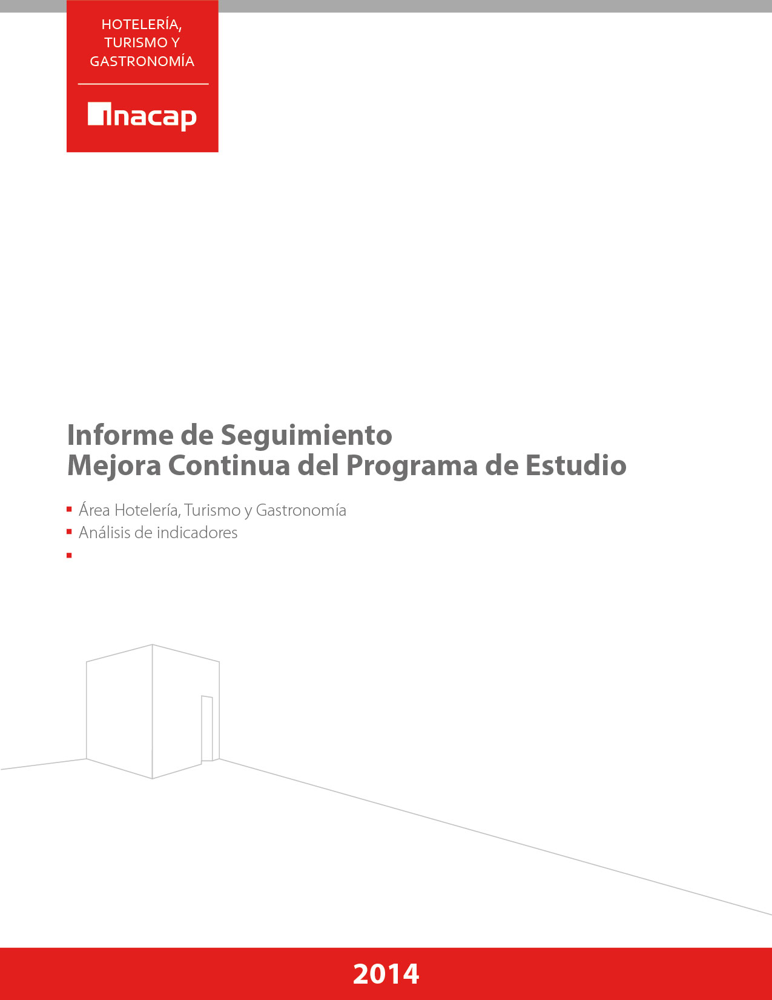

INFORME DE REQUISITOS DEL NEGOCIO
Caso de Estudio: ComercioTech
Bases de Datos No Estructuradas — TI3032
Ingeniería en informática
tecnologías de la información y Ciberseguridad — INACAP
Harold Concha – Keoni Vergara, 12 junio de 2026

# 1. introducción

La empresa ComercioTech se encuentra en proceso de expansión y requiere modernizar su infraestructura de base de datos para gestionar eficientemente el creciente volumen de clientes, productos y transacciones. El presente informe detalla el análisis de requisitos funcionales y no funcionales que debe cumplir la nueva solución tecnológica, sirviendo como base para las decisiones de diseño, selección de plataforma y configuración del entorno.

# 2. Contexto y Descripción del Negocio

## 2.1 Descripción General de ComercioTech
ComercioTech es una empresa de comercio en expansión que actualmente opera con una base de datos heredada que no soporta las nuevas funcionalidades requeridas por el negocio. La empresa necesita una solución robusta, segura y escalable para gestionar sus entidades principales:
- Clientes: datos personales, historial de compras, preferencias.
- Productos: catalogo, stock, precios, categorías.
- Pedidos: órdenes de compra, estados, trazabilidad, facturación.

## 2.2 Problemática Actual
La infraestructura legada presenta las siguientes limitaciones criticas:
- Incapacidad de escalar ante el crecimiento proyectado de usuarios y transacciones.
- Ausencia de mecanismos de seguridad modernos (sin cifrado en reposo ni en tránsito).
- Rendimiento degradado ante consultas concurrentes de alto volumen.
- Falta de soporte para datos semiestructurados y esquemas flexibles.
- Carencia de herramientas de auditoría y cumplimiento normativo.

# 3. Necesidades del Negocio

A partir del análisis del caso de estudio, se identifican las siguientes necesidades estratégicas de la organización:

| Area | Necesidad Identificada |
| --- | --- |
| Crecimiento | Soportar el incremento de clientes activos y transacciones diarias en un entorno de expansión continua. |
| Flexibilidad | Adoptar un modelo de datos adaptable que permita incorporar nuevos atributos sin migraciones costosas. |
| Seguridad | Garantizar la protección de datos sensibles de clientes mediante cifrado, control de acceso y auditoria. |
| Disponibilidad | Asegurar operación continua (24/7) con tolerancia a fallos y recuperación ante desastres. |
| Cumplimiento | Cumplir con normativas de privacidad de datos (GDPR, Ley 19.628 en Chile) y estándares de seguridad. |

# 4. Requisitos Funcionales

Los requisitos funcionales describen las capacidades específicas que el sistema de base de datos debe proveer para satisfacer las operaciones del negocio.

## 4.1 Gestión de Clientes
RF-01: Registro y Consulta de Clientes
El sistema debe permitir registrar, consultar, actualizar y eliminar información de clientes, incluyendo: nombre completo, RUT, correo electrónico, dirección, teléfono, historial de compras y preferencias de navegación.

RF-02: Segmentación de Clientes
El sistema debe soportar la categorización de clientes por criterios dinámicos (frecuencia de compra, región geográfica, categoría de productos preferidos), permitiendo actualizaciones sin alterar el esquema base.

## 4.2 Gestión de Productos
RF-03: Catálogo de Productos
El sistema debe gestionar un catálogo de productos con atributos variables según categoría (electrónica, ropa, alimentos, etc.), soportando campos opcionales y anidados sin penalización de rendimiento.

RF-04: Control de Inventario
El sistema debe actualizar el stock en tiempo real ante cada transacción, garantizando consistencia en escenarios de escritura concurrente mediante mecanismos de control de concurrencia.

## 4.3 Gestión de Pedidos
RF-05: Ciclo de Vida del Pedido
El sistema debe registrar y gestionar el ciclo completo de un pedido: creación, pago, preparación, despacho y entrega. Cada cambio de estado debe quedar registrado con marca de tiempo y usuario responsable.

RF-06: Historial Transaccional
El sistema debe conservar un historial inmutable de todas las transacciones para efectos de auditoría, facturación y análisis de comportamiento comercial.

## 4.4 Operaciones CRUD
RF-07: Operaciones sobre Colecciones
El DBMS debe exponer interfaces para realizar operaciones CRUD (Créate, Read, Update, Delete) sobre las colecciones de clientes, productos y pedidos, accesibles desde componentes de software en Python o Node.js.

RF-08: Consultas Avanzadas
El sistema debe soportar consultas con filtros compuestos, ordenamiento, paginación y agregaciones (sumas, promedios, agrupaciones) sobre colecciones de gran volumen con tiempos de respuesta aceptables.

## 4.5 Resumen de Requisitos Funcionales

| ID | Modulo | descripción | Prioridad |
| --- | --- | --- | --- |
| RF-01 | Clientes | Registro y consulta de datos de clientes. | Alta |
| RF-02 | Clientes | segmentación dinámica de clientes. | Media |
| RF-03 | Productos | Catalogo con atributos variables por categoría. | Alta |
| RF-04 | Productos | Control de inventario en tiempo real. | Alta |
| RF-05 | Pedidos | gestión del ciclo de vida del pedido. | Alta |
| RF-06 | Pedidos | Historial transaccional inmutable para auditoria. | Alta |
| RF-07 | CRUD | Operaciones CRUD accesibles desde software. | Alta |
| RF-08 | Consultas | Consultas avanzadas con filtros y agregaciones. | Media |

# 5. Requisitos No Funcionales

Los requisitos no funcionales establecen las restricciones de calidad, rendimiento y operación bajo las cuales el sistema debe funcionar.

## 5.1 Volumen de Datos
RNF-01: Capacidad de Almacenamiento
El sistema debe soportar, sin degradación apreciable, los siguientes volúmenes estimados para ComercioTech:

| Entidad | Volumen Actual | proyección 3 años | Crecimiento Anual |
| --- | --- | --- | --- |
| Clientes | 50.000 registros | 250.000 registros | ~70% |
| Productos | 10.000 Sus | 50.000 Sus | ~50% |
| Pedidos | 500.000 documentos | 5.000.000 documentos | ~100% |
| Almacenamiento Total | ~80 GB | ~1 TB | — |

## 5.2 Requisitos de Rendimiento, Escalabilidad y Disponibilidad
RNF-02: Rendimiento de Consultas
Las consultas de lectura sobre colecciones primarias deben completarse en menos de 200 ms bajo carga normal (hasta 500 usuarios concurrentes). Las operaciones de escritura individual no deben superar los 500 ms.

RNF-03: Escalabilidad Horizontal
La arquitectura debe permitir escalar horizontalmente (Harding) de forma transparente a medida que el volumen de datos y la concurrencia de usuarios superen los umbrales definidos, sin tiempo de inactividad del servicio.

RNF-04: Disponibilidad y Alta Disponibilidad

| parámetro | Valor Requerido | observación |
| --- | --- | --- |
| Disponibilidad mínima | 99,9% (máximo 8,7 h/año Down time) | SLA de producción |
| RTO (Recovera Time Objective) | 4 horas máximo | Ante fallo critico |
| RPO (Recovera Point Objective) | 1 hora Maxima de perdida de datos | Maxima perdida de datos aceptable |
| Backus automáticos | Diarios + incremental horario | retención mínima 30 días |

RNF-05: Concurrencia
El sistema debe soportar al menos 500 conexiones concurrentes en horario pico (temporadas de alta demanda) sin caída de rendimiento superior al 20% respecto a la línea base.

## 5.3 Requisitos de Seguridad y Cumplimiento Normativo
RNF-06: autenticación y autorización
El DBMS debe implementar autenticación robusta mediante usuario/contraseña con política de contraseñas seguras, y soporte opcional para autenticación mediante certificados X.509 o LDAP. El acceso a colecciones debe regirse por el principio de mínimo privilegio mediante roles personalizados.

RNF-07: Cifrado de Datos
- Cifrado en reposo: AES-256 para todos los archivos de datos y respaldos.
- Cifrado en tránsito: TLS 1.2 o superior para todas las conexiones cliente-servidor y entre nodos del clúster.
- Cifrado de campos sensibles: datos de tarjetas de pago y RUT deben cifrarse a nivel de campo de la colección.

RNF-08: Auditoria y Trazabilidad
El sistema debe registrar en logs de auditoria todas las operaciones de escritura (INSERT, UPDATE, DELETE), intentos de acceso fallidos, cambios de configuración y creación/modificación de usuarios. Los logs deben ser inmutables y almacenarse en un sistema separado.

RNF-09: Cumplimiento Normativo
La solución debe cumplir con los siguientes marcos regulatorios:

| Normativa | Requisito Principal | Impacto en el Sistema |
| --- | --- | --- |
| GDPR (UE) | Derecho al olvido, portabilidad y consentimiento explicito. | Mecanismo de eliminación y exportación por usuario. |
| Ley 19.628 (CL) | protección de datos personales en Chile. | Cifrado y control de acceso a información personal. |
| PCI-DSS | Seguridad en el manejo de datos de tarjetas de pago. | Tokenizacion y cifrado de datos financieros. |
| ISO/IEC 27001 | Sistema de gestión de Seguridad de la información. | Políticas de acceso, respaldo y recuperación. |

## 5.4 Requisitos técnicos
RNF-10: Modelo de Datos No Relacional
La solución debe emplear un DBMS NoSQL orientado a documentos (MongoDB u equivalente) que permita esquemas flexibles, almacenamiento de documentos JSON/BSON anidados y consultas ad-hoc eficientes, adecuado para los patrones de acceso de ComercioTech.

RNF-11: Entorno de virtualización
El DBMS debe desplegarse en un entorno virtualizado (VirtualBox, VMware o contenedores Docker/Podman), facilitando la replicabilidad del entorno, el aislamiento de recursos y la portabilidad entre ambientes de desarrollo, pruebas y producción.

RNF-12: Compatibilidad de Plataforma
El sistema operativo anfitrión debe ser compatible con la versión LTS más reciente del DBMS seleccionado. Se preferida una distribución Linux de soporte extendido (Ubuntu Server LTS o RHEL/CentOS) por estabilidad y disponibilidad de parches de seguridad.

## 

## 

## 

## 

## 

## 

## 

## 5.5 Resumen de Requisitos No Funcionales

| ID | Categoría | Descripción Resumida | Prioridad |
| --- | --- | --- | --- |
| RNF-01 | Volumen | Soportar hasta 1 TB / 5M pedidos en 3 años. | Alta |
| RNF-02 | Rendimiento | Lecturas < 200 ms, escrituras < 500 ms. | Alta |
| RNF-03 | Escalabilidad | Escalado horizontal sin Down time (sharding). | Alta |
| RNF-04 | Disponibilidad | 99,9% uptime; RTO 4h; RPO 1h. | Alta |
| RNF-05 | Concurrencia | 500+ conexiones concurrentes en horario pico. | Alta |
| RNF-06 | Seguridad | Autenticación por roles con mínimo privilegio. | Alta |
| RNF-07 | Cifrado | AES-256 en reposo; TLS 1.2+ en tránsito. | Alta |
| RNF-08 | Auditoria | Logs inmutables de todas las operaciones críticas. | Alta |
| RNF-09 | Normativa | Cumplimiento GDPR, Ley 19.628, PCI-DSS, ISO 27001. | Alta |
| RNF-10 | Técnico | DBMS NoSQL documental (MongoDB o equivalente). | Alta |
| RNF-11 | Virtualización | Despliegue en entorno virtualizado o contenedorizado. | Media |
| RNF-12 | Compatibilidad | SO Linux LTS compatible con el DBMS seleccionado. | Media |

# 6. Conclusiones

El presente análisis de requisitos establece una base técnica sólida para la modernización de la infraestructura de datos de ComercioTech. Los requisitos identificados responden directamente a las necesidades operativas del negocio:

- Los requisitos funcionales definen con precisión las capacidades de gestión de clientes, productos y pedidos que el DBMS debe soportar, orientando el diseño de colecciones y la lógica de aplicación.
- Los requisitos no funcionales de rendimiento, escalabilidad y disponibilidad justifican técnicamente la adopción de una base de datos NoSQL distribuida con capacidades de replicación y Harding.
- Los requisitos de seguridad y cumplimiento normativo imponen controles técnicos específicos (cifrado, RBAC, auditoria) que deben configurarse desde la instalación del DBMS.
- Los requisitos técnicos orientan la selección del sistema operativo y la plataforma de virtualización hacia soluciones Linux estables y reconocidas en entornos de producción.

Las etapas siguientes del proyecto (selección del SO, configuración del entorno virtualizado, instalación del DBMS y diseño del modelo de datos) deben ejecutarse en coherencia estricta con los requisitos aquí definidos.

# 7. Referencias

- MongoDB, Inc. (2024). MongoDB Documentation — Security Checklist. Disponible en: https://www.mongodb.com/docs/manual/administration/security-checklist/
- Union europea. (2016). Reglamento General de protección de Datos (RGPD) — Reglamento (UE) 2016/679.
- Biblioteca del Congreso Nacional de Chile. (1999). Ley N. 19.628 sobre protección de la Vida Privada.
- PCI Security Standards Council. (2022). PCI DSS v4.0 — Payment Card Industry Data Security Standard.
- ISO/IEC. (2022). Norma ISO/IEC 27001:2022 — Information security management systems.
- Fowler, M. (2012). NoSQL Distilled: A Brief Guide to the Emerging World of Polyglot Persistence. Addison-Wesley.