---

# INFORME TÉCNICO - Implementación de Infraestructura de Base de Datos Segura - Caso de estudio: ComercioTech - Harold Concha – Keoni Vergara.

---

| Asignatura | Bases de Datos No Estructuradas (TI3032) |
| --- | --- |
| Unidad | Unidad 4 — Unidad Integradora |
| Evaluación | Sumativa 4 (ponderación 30%) |
| Área | Tecnologías de la Información y Ciberseguridad |
| DBMS | MongoDB Community Server |
| Sistema Operativo | Amazon Linux 2023 |
| Cloud / Virtualización | Amazon Web Services (EC2) |
| Fecha | 16 de junio de 2026 |

> 📋 1. Diagnóstico e identificación de necesidades

La empresa ComercioTech se encuentra en proceso de expansión y requiere modernizar su infraestructura de base de datos. Su sistema heredado no soporta las nuevas funcionalidades ni el volumen creciente de clientes, productos y transacciones. Se necesita una solución robusta, segura y escalable.

## 1.1 Requisitos funcionales

- Gestión de clientes (alta, consulta, actualización y baja).
- Catálogo de productos con atributos variables según categoría.
- Registro y seguimiento de pedidos con sus líneas de detalle.
- Consultas analíticas: pedidos por cliente, productos más vendidos, montos por periodo.
- Operaciones CRUD completas desde la capa de aplicación.

## 1.2 Requisitos no funcionales

| Categoría | Requisito |
| --- | --- |
| Rendimiento | Respuesta < 200 ms en consultas indexadas frecuentes. |
| Escalabilidad | Soporte de crecimiento horizontal (sharding) y vertical. |
| Disponibilidad | Objetivo 99,5%; preparado para Replica Set. |
| Seguridad | Autenticación obligatoria, autorización por roles (RBAC), cifrado en tránsito y reposo. |
| Cumplimiento | Alineado a GDPR y a la Ley 19.628 sobre protección de datos personales (Chile). |
| Respaldo | Backups periódicos y restauración verificada. |

## 1.3 Volúmenes estimados

| Entidad | Actual | Proyección 12 meses |
| --- | --- | --- |
| Clientes | ~5.000 | ~25.000 |
| Productos | ~1.200 | ~4.000 |
| Pedidos / mes | ~3.000 | ~18.000 |

> 💻 2. Selección del Sistema Operativo

El DBMS seleccionado es MongoDB, base de datos NoSQL orientada a documentos, idónea para esquemas flexibles como el catálogo de productos de ComercioTech. La elección del sistema operativo se realiza considerando los requisitos del software de base de datos.

## 2.1 Especificaciones técnicas evaluadas

| Criterio | Detalle de la decisión |
| --- | --- |
| Versión | Amazon Linux 2023 (AMI oficial AWS, soporte de seguridad hasta 2028). |
| Recursos | Instancia t3.micro: 2 vCPU, 1 GB RAM, 8 GB EBS gp3 (capa gratuita AWS, entorno académico/piloto). |
| Seguridad | Soporte nativo de firewalld, SELinux, OpenSSL y gestión granular de usuarios/permisos; Security Groups y IMDSv2 a nivel de AWS. |
| Red | VPC vpc-09d7127f912560a82, subred subnet-01dc5fddce9ab9aa4; IP privada 172.31.31.239, IP pública 54.160.160.42. Puerto 27017 restringido por Security Group. |
| Configuraciones | Repositorio oficial de MongoDB disponible para Amazon Linux 2023 (yum/dnf); instalación y servicio gestionados con systemd. |

## 2.2 Comparación de sistemas operativos

| SO | Compatibilidad MongoDB | Costo | Implementación |
| --- | --- | --- | --- |
| Amazon Linux 2023 | Oficial / repositorio dedicado | Gratuito (AMI sin costo; capa gratuita EC2) | Sencilla en AWS, integración nativa |
| Windows Server 2022 | Soportado | Licencia de pago | Media, mayor consumo de recursos |
| Red Hat / RHEL | Oficial | Suscripción de pago | Media, orientado a empresa |

Justificación: Amazon Linux 2023 ofrece compatibilidad oficial con MongoDB, optimización para la infraestructura de AWS, parches de seguridad gestionados por Amazon, costo nulo de licencia (solo se paga el cómputo EC2, cubierto por la capa gratuita en t3.micro) y la mejor relación entre facilidad de implementación e integración con el resto de servicios cloud.

## 2.3 Plataforma de virtualización

| Criterio | Decisión |
| --- | --- |
| Plataforma | Amazon Web Services — Elastic Compute Cloud (EC2) |
| Compatibilidad | Ejecuta Amazon Linux 2023 de forma nativa mediante la AMI oficial; instancia t3.micro en us-east-1. |
| Rendimiento | Tipo t3.micro (burstable) adecuado para laboratorio; permite escalar de tipo de instancia y añadir volúmenes EBS según necesidad. |
| Costos | Cubierto por la capa gratuita de AWS (750 h/mes de t3.micro durante 12 meses); facturación por uso bajo demanda. |
| Facilidad de implementación | Consola web AWS, acceso por SSH con par de llaves, Security Groups y snapshots EBS configurables. |

> ⚙ 3. Configuración del Sistema Operativo

Procedimiento documentado de configuración del entorno virtualizado y del sistema operativo previo a la instalación del DBMS.

## 3.1 Lanzamiento de la instancia EC2

- En la consola EC2, lanzar una instancia seleccionando la AMI oficial Amazon Linux 2023 (64-bit x86).
- Elegir el tipo de instancia t3.micro (2 vCPU, 1 GB RAM) dentro de la capa gratuita.
- Crear un par de llaves (key pair .pem) para el acceso SSH y configurar un volumen raíz EBS gp3 de 8 GB.
- Asociar la VPC (vpc-09d7127f912560a82) y subred, habilitar IP pública e IMDSv2, y lanzar la instancia.

## 3.2 Ajustes iniciales y de red

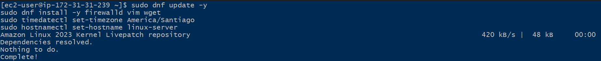

## 3.3 Firewall (Security Groups + firewalld)

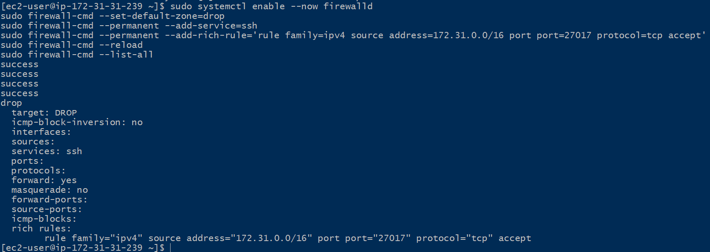

## 3.4 Usuarios y servicios

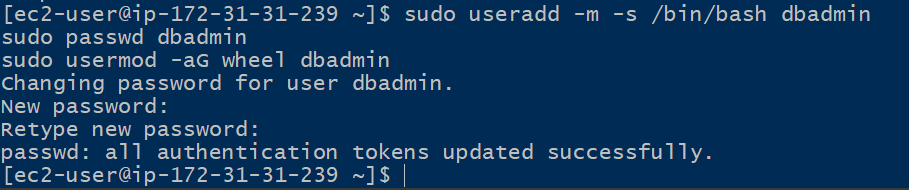

> 🛠 4. Instalación y configuración de MongoDB

## 4.1 Instalación desde repositorio oficial

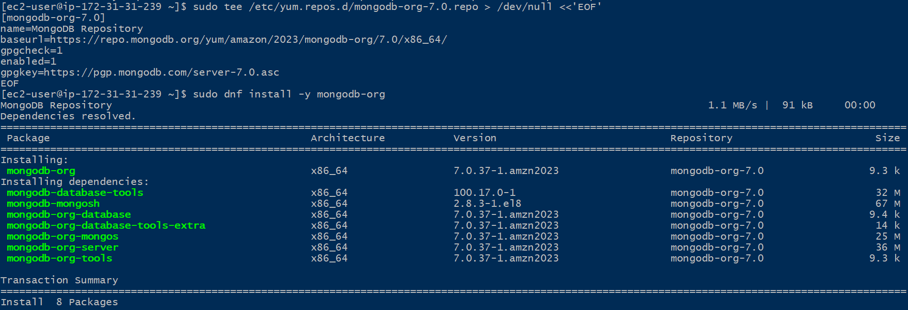
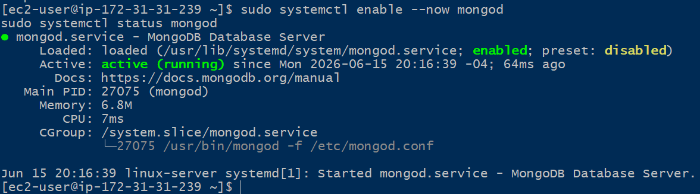
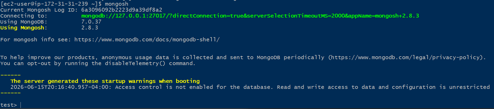

## 4.2 Habilitar autenticación

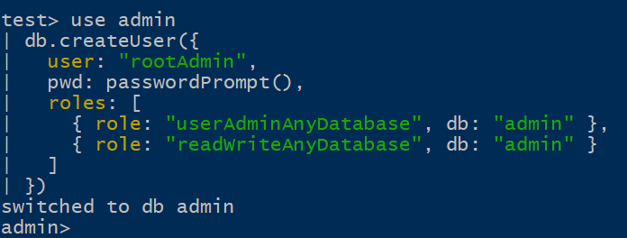
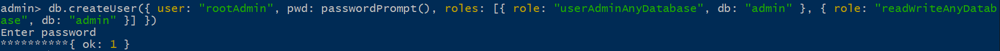

## 4.3 Roles y permisos de la base de datos

Se definen tres roles según el principio de mínimo privilegio para la base de datos comerciotech:

| Rol | Privilegios | Asignado a |
| --- | --- | --- |
| rootAdmin | Administración total de la BD y de usuarios. | Administrador de base de datos |
| readWrite | Lectura y escritura sobre las colecciones (CRUD). | Aplicación / backend ComercioTech |
| read | Solo lectura, para reportería y análisis. | Analistas / dashboards |

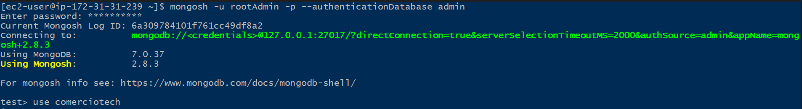
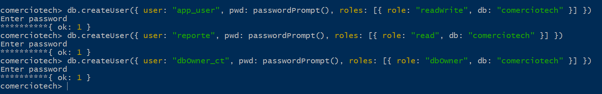
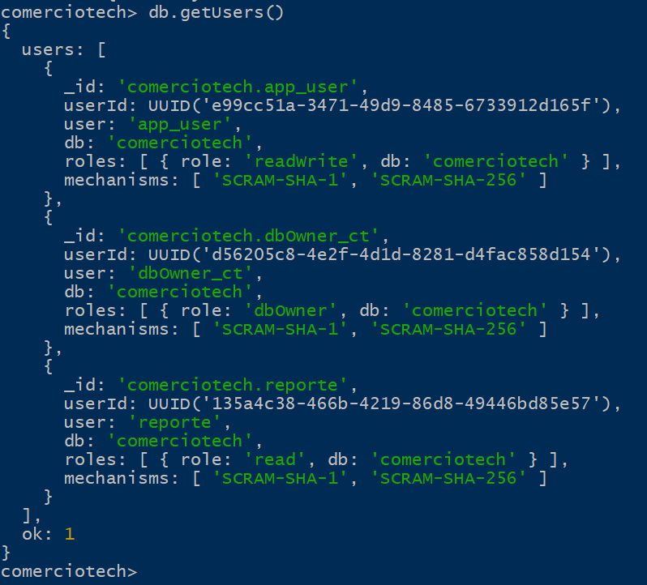

## 4.4 Política de acceso

- Acceso bajo el principio de mínimo privilegio: cada cuenta recibe solo los permisos imprescindibles.
- Autenticación obligatoria; queda prohibido el acceso anónimo a la base de datos.
- Contraseñas robustas (mínimo 12 caracteres, mezcla de tipos) y rotación periódica.
- El usuario de aplicación nunca posee privilegios administrativos.
- Conexiones remotas restringidas por Security Group y firewall a la red interna de la VPC 172.31.0.0/16.
- Registro y auditoría de accesos y operaciones administrativas.

> 🔒 5. Hardening (bastionado) del servidor y la base de datos

## 5.1 Cifrado

- Cifrado en tránsito: habilitar TLS/SSL en mongod (net.tls.mode: requireTLS) con certificado.
- Cifrado en reposo: habilitar el cifrado del volumen EBS (AWS KMS) y/o el motor de almacenamiento cifrado de MongoDB (encryptionAtRest).
- Comunicaciones administrativas únicamente vía SSH con llaves.

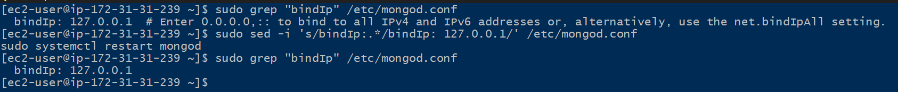

## 5.2 Auditoría

Habilitar el registro de eventos de autenticación y operaciones sobre datos sensibles para trazabilidad y cumplimiento normativo.

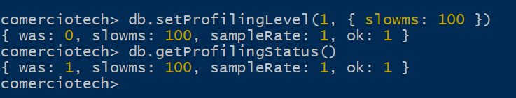

## 5.3 Copias de respaldo de la base de datos

> # Cron no viene por defecto
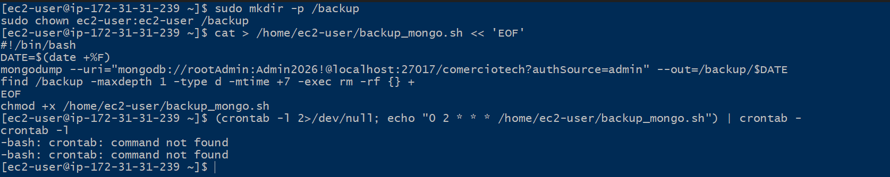
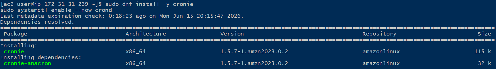
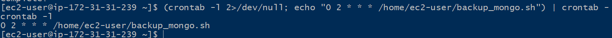
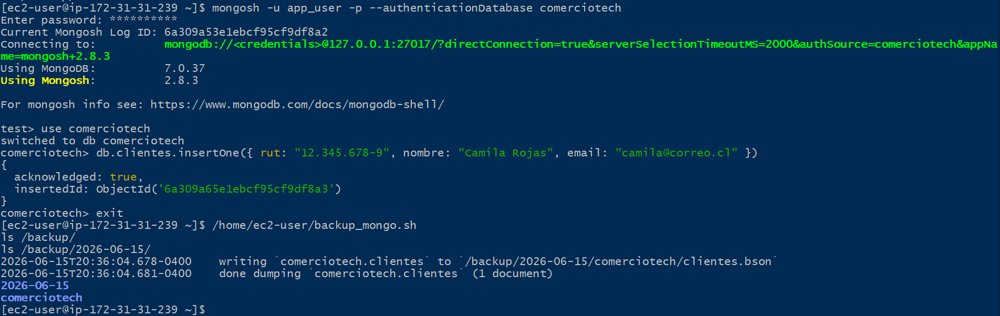

Política de respaldo: copia diaria automatizada, retención de 7 copias, almacenamiento en volumen separado y verificación periódica de la restauración.

> 🗄 6. Modelado y estructura de la base de datos

Se diseñan tres colecciones principales. Se aplica referenciación entre pedidos y clientes (relaciones de alta cardinalidad) e incrustación de las líneas de detalle dentro del pedido (datos que se consultan juntos).

## 6.1 Colección clientes

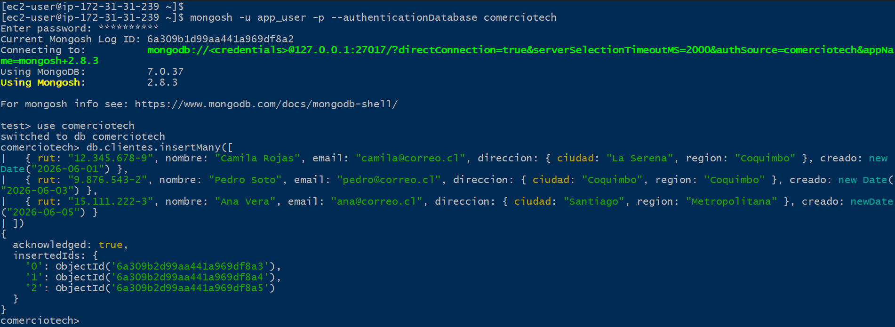

## 6.2 Colección productos

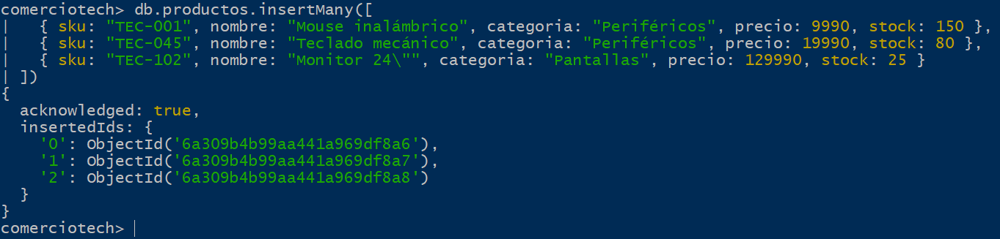

## 6.3 Colección pedidos (con detalle incrustado y referencia a cliente)

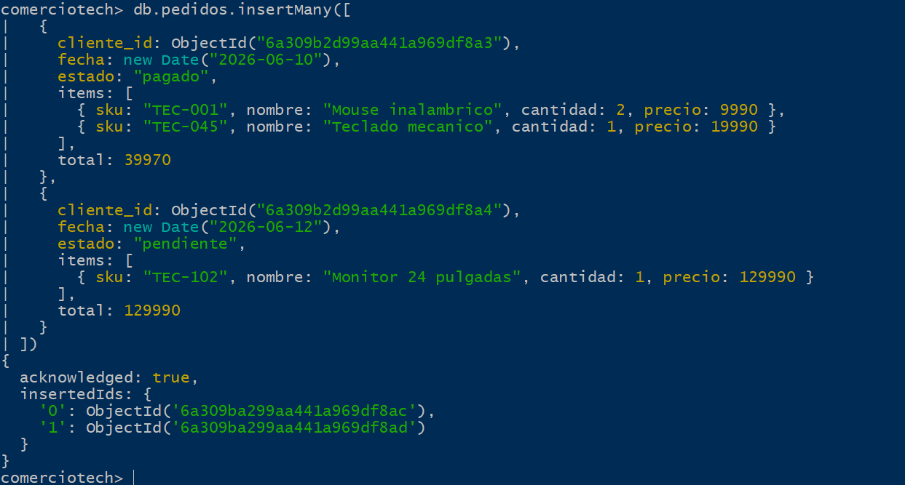

> 💾 7. Componentes de software — Conexión y CRUD

Componente desarrollado en Python con el driver oficial pymongo, demostrando conexión autenticada y operaciones CRUD sobre la base de datos comerciotech.

## 7.1 Conexión segura

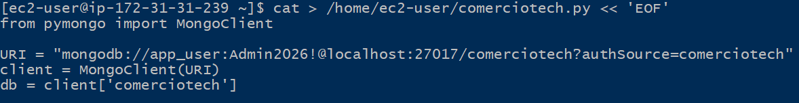

## 7.2 Operaciones CRUD

> UPDATE
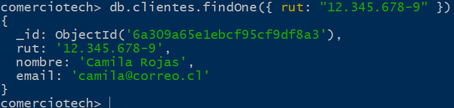
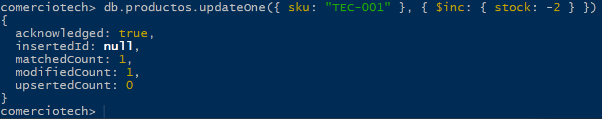

## 7.3 Consulta analítica (aggregation)

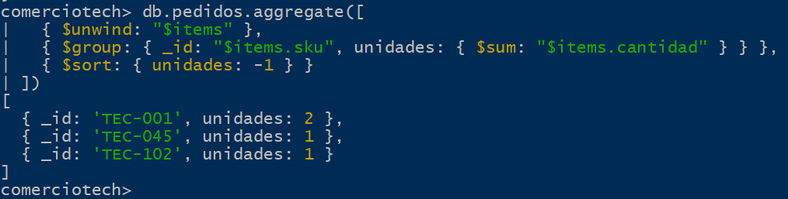
Zz

> 📝 8. Conclusiones — aspectos normativos y éticos

La solución implementada para ComercioTech cumple los criterios de evaluación de la unidad: identifica requisitos del negocio, selecciona y justifica el sistema operativo, lo configura en un entorno virtualizado, instala el DBMS con medidas de seguridad, modela la base de datos y desarrolla componentes con conexión y CRUD.

En el plano normativo y ético, el tratamiento de datos de clientes obliga a respetar la Ley 19.628 sobre protección de la vida privada (Chile) y, para clientes internacionales, el GDPR europeo. Por ello se aplicaron principios de minimización de datos, control de acceso por roles, cifrado y auditoría.

Éticamente, la confidencialidad e integridad de los datos personales es responsabilidad directa del equipo técnico: el acceso a la información debe limitarse a lo estrictamente necesario, evitando usos no autorizados y garantizando la trazabilidad de toda operación administrativa sobre la base de datos.